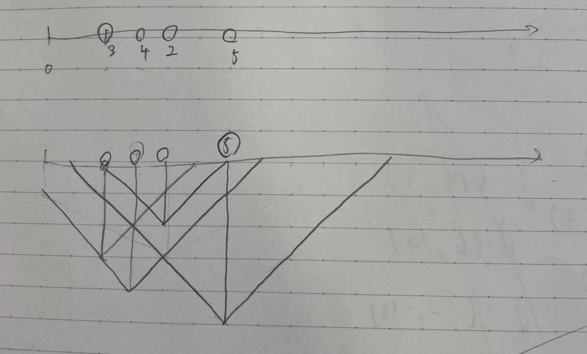

# はじめに

2/5,12でオンラインで開催された日本情報オリンピックの本選に参加しました

結果は243点でBランク(~~**素晴らしい成績**~~)

# 本選前(~2/4)

2月に本戦があるな〜程度に思いながらJOI精進を少しずつ進めてました

他にはゲームで遊んだりゲーム作ったりして、死ぬほど精進していたわけでもない

# 1日目(2/5)

### 開会式
いろんな人の自己紹介動画が面白かった

特にたこ焼きロシアンルーレットはよく思いついたなぁ、と

### チューター企画
xy逆にする馬鹿をやらかした....

# 2日目(2/12)

9:30起床

### 1問目(A - 碁石ならべ 2)
問題見てもよくわからなかったので、JOIあるある「制約を順に考える」で考えてみる

すると、小課題2で前半黒(白)/後半白(黒)となるとわかる

これを一般の色に適用すれば、色1...色2...色3...色4...のようになるとわかった

あとは、ランレングス圧縮をかければ色更新がN回で済むことを利用してAC(開始40分頃)

解説の解法、頭良すぎませんか...

### 2問目(B - 宣伝 2)
よくわからんので数直線上に書いてみる

すると、人Aの三角形が人Bの三角形に周を含んで完全に含まれていれば、人Bに献本すればAは買うことになることがわかった

そこから図形的に考えてみたり(凸頂点の数を数えられるか)、区間っぽく考えてみたり(取り除いても区間の状態が変わらないものを選ぶ)したが、なかなかわからなかったのでO(N^2)解で部分点を得る(69点/開始1:15頃)

どっちの解法も解説で触れられてて鬱

### 3問目(C - 迷路)
Bで満点が取れなかったのでここから部分点をとっていくムーブに切り替え、とりあえず全問題に目を通す

[器物損壊！高橋くん](https://atcoder.jp/contests/arc005/tasks/arc005_3)に想いを馳せるも、わからん...

グリッド上の問題練習しておけばよかった

とりあえず、小課題1で01-BFSをして終了

### 4問目(D - キャットエクササイズ)
猫はかわいいね！

木だなぁと思って木DP(わからない)を覚悟

まずは愚直に「自分より低いところを通っていける距離」を求めた後に再帰関数書いてO(N^2)解で31点

その後1hくらいした後に、明らかに特殊な小課題5,6を考えて、小課題5をセグ木で殴った

実装してるうちにスパゲティになってきて怖かったけどなんとか部分点を得る(51点)

小課題6は二分木だなぁとだけ思って考察は進まず..

### 5問目(E - 現代的な機械)
ビ太郎くん登場問

まずは愚直なシミュレーション解を提出して3点

その後、もう少し考えるとボタン操作1回でボールがどこから出るのかはボールの左右にある青と赤のタイルの数を考えればO(N)で計算可能だとわかった

あとはそれを提出して部分点(15点)

# 感想

問題2は満点とりたかったしとるべき問題だったなぁ...せっかくの問題6の部分点がその埋め合わせにもなってないのは悲しい

春行きたかったけど、完全に実力不足ですね

そして本戦突破して春に行けた人は本当にすごすぎる...