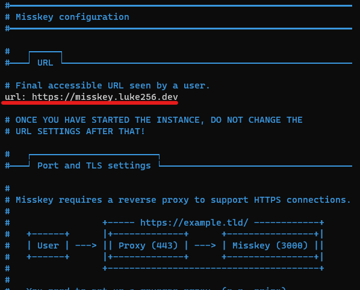
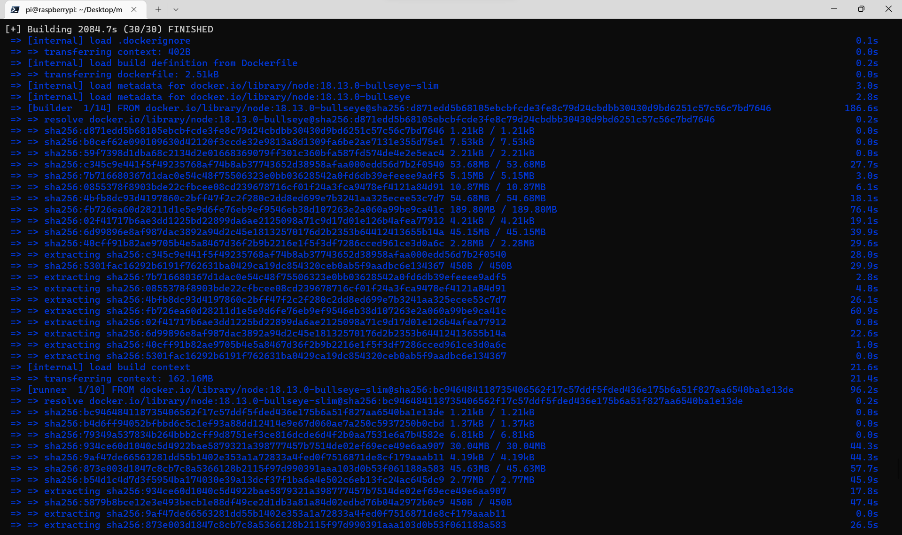
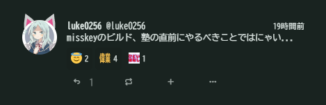
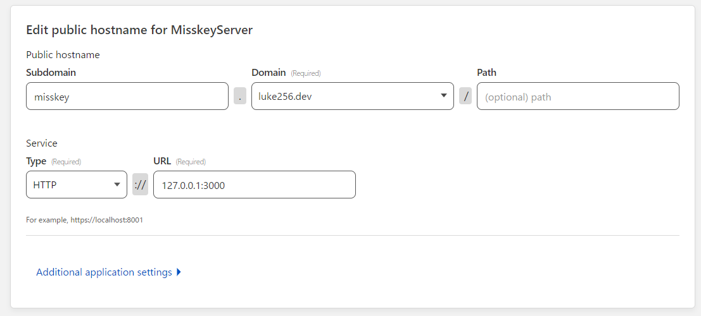
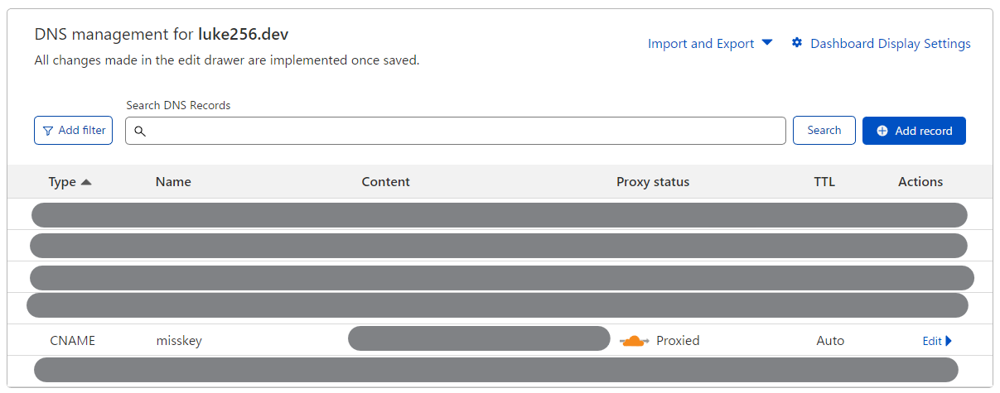
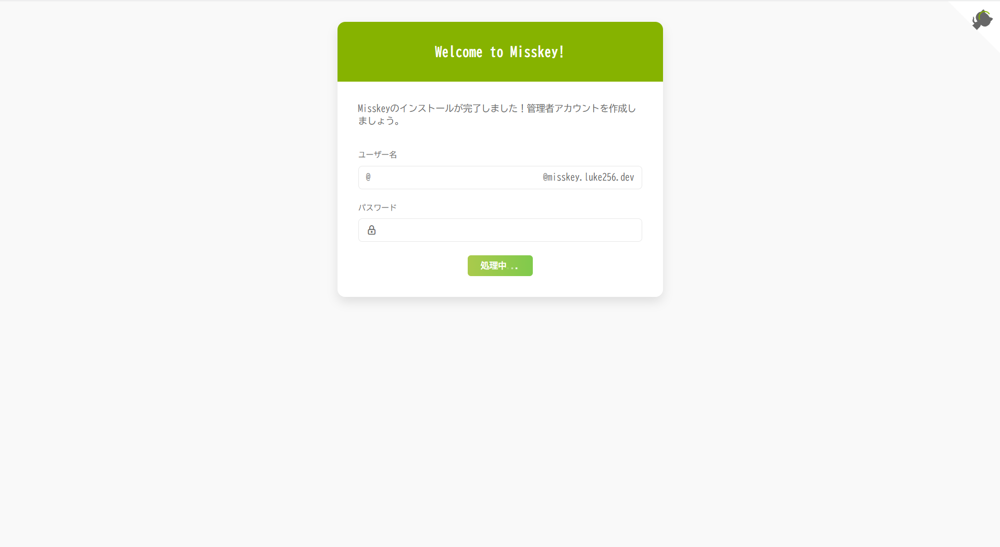

# はじめに
misskeyのインスタンスを立てたよ！っていうお話

最近twitterが不安定なのでこれを機に別のSNSに移ってみるものありかなぁと思って作ってみた

https://misskey.luke256.dev

# 環境
- マシン: RaspberryPi 4B
- OS: RaspberryPi OS 64bit (_Debian GNU/Linux 11 (bullseye)_)

**注意**  
RaspberryPiのOSが古い(2020くらい?)とdocker諸々が入ってくれないので、一度OSを吹き飛ばしてから最新のものを入れることを推奨

### 追記(2023-02-27)
OSは64bitを使うことをお勧めします。  
(32bitだとdockerが動いてもcypressが32bitに対応してくれていない)

# dockerのインストール
まずはdockerが必要なのでインストール

```sh
curl -fsSL https://get.docker.com -o get-docker.sh
sudo sh get-docker.sh
```

# misskeyのインスタンスを立てていく
基本的には[公式ガイド](https://misskey-hub.net/docs/install/docker.html)を見ながら進めていく

### リポジトリの取得

```sh
git clone -b master https://github.com/misskey-dev/misskey.git
cd misskey
git checkout master
```

落としてきたリポジトリに諸々全部入ってる

### 設定

設定ファイルがあるので、それらを適切な場所にコピー

```sh
cp .config/docker_example.yml .config/default.yml
cp .config/docker_example.env .config/docker.env
cp ./docker-compose.yml.example ./docker-compose.yml
```

ガイドだと
> `default.yml`と`docker.env`をファイル内の説明に従って編集してください。
> また、必要に応じて、`docker-compose.yml`を編集します。(ポートを変更したい場合など)

と書かれているけど、基本的には`default.yml`の最初の`url`だけで十分

 

### ビルドと初期化

misskeyをビルド、初期化します

```sh
sudo docker compose build
sudo docker compose run --rm web pnpm run init
```

僕のところだと、ビルドに大体45分かかった  
低電圧だったとはいえ、さすがに長い...


2084秒....



というわけで無事ビルドと初期化が完了。初期化はそこまで時間はかからなかった

ただ、この状態だとまだ`./files`フォルダに権限がなくてファイルのアップロードができないらしいので、権限を追加してあげる

```sh
sudo chown -hR 991.991 ./files
```
(何やってるコマンドなのか...)

### 起動

最後に、起動してあげる

```sh
sudo docker compose up -d
```

## ネットに公開する

ネットに公開するには自宅のポートを開放する、CloudflareのTunnelを使うなどなどあるけど、今回は後者を使った

前提として、Cloudflareに登録していて、使うドメインのDNSが設定されていること  

### Tunnelの新規作成
[CloudflareのZeroTrustのページ](https://one.dash.cloudflare.com/)に飛んで、「Create a tunnel」から新しくTunnelを作成  

### ラズパイの登録
そのあと、「Choose your environment」から「Debian」→「arm64-bit」で、書いてあるコマンドをペタッとする

こんな感じのコマンド
```sh
curl -L --output cloudflared.deb https://github.com/cloudflare/cloudflared/releases/latest/download/cloudflared-linux-arm64.deb && 

sudo dpkg -i cloudflared.deb && 

sudo cloudflared service install SECRET_TOKEN!!!
```

(正直ここは何を選べばいいのかわからない)

(動いたのでヨシ！)

そうすると下になんか自分のラズパイっぽい項目が出てくるので、次に進む

### ドメインの登録
出てくる画面の上段に実際に表示させたいURL、下段にはラズパイ上でMisskeyが立っているURL(デフォルトなら`127.0.0.1:3000`)を入れる  

こんな感じになる↓


上段のDomainsでDNSが登録されているドメインが選択できる  
できたらSave

すべて終わると、ダッシュボードのDNSの欄にさっき設定したURLがCNAMEで出てくるはず



そしたら、数十分程度待ってあげると...



Hello, Misskey！！！！

# おわりに
実は、数年前から何もいじってなかったラズパイを引っ張り出してきたせいで、OSが古くて全然入りませんでした...32bit....

この後は、別クライアントで作ったアカウントのフォロー/フォロワーをインポートするなり、インスタンスをいろいろいじってみるなりして楽しみましょう！

ありがとうございました

(ちなみに、この記事では一度も出なかったけどtailscaleがあるととても便利だった)
